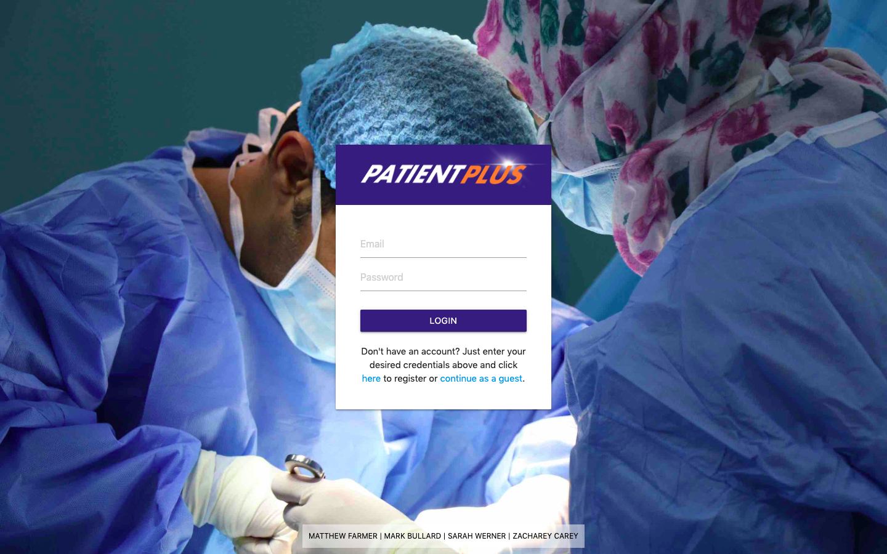
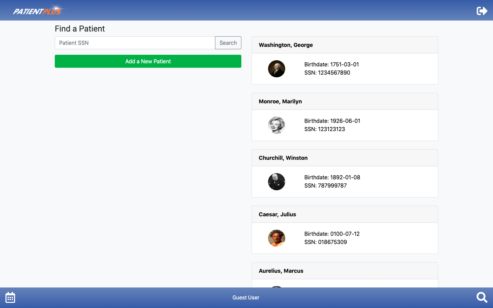
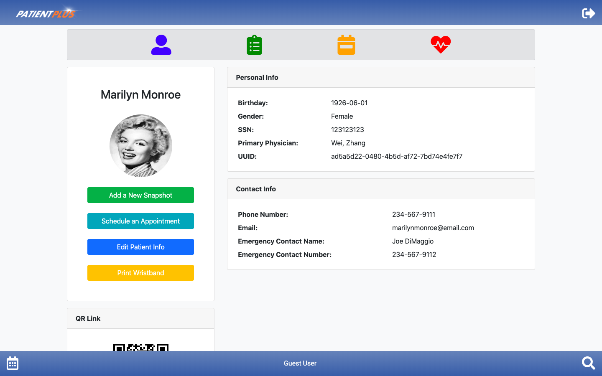
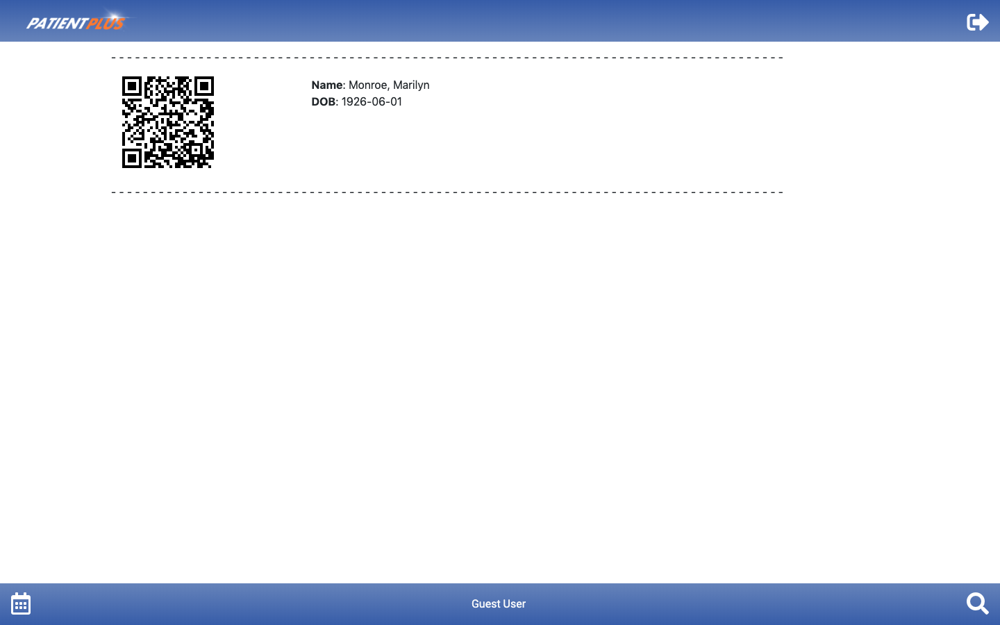
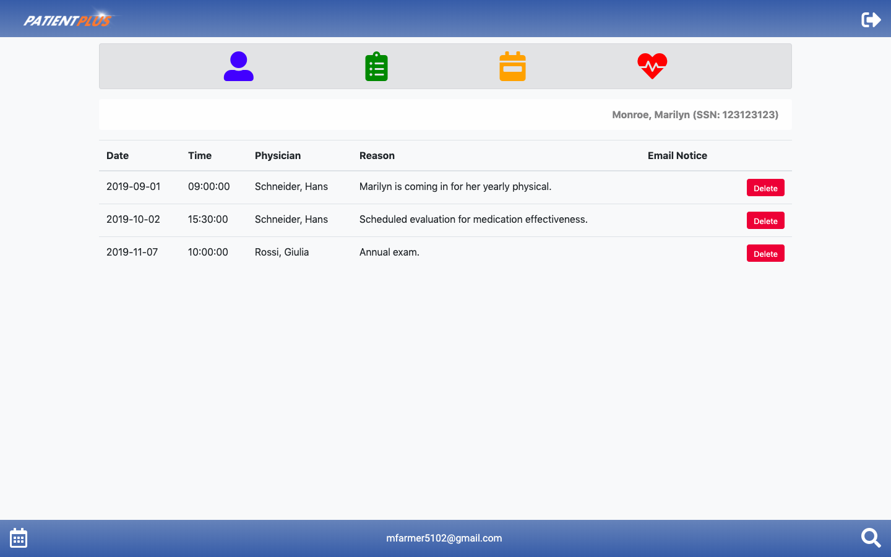
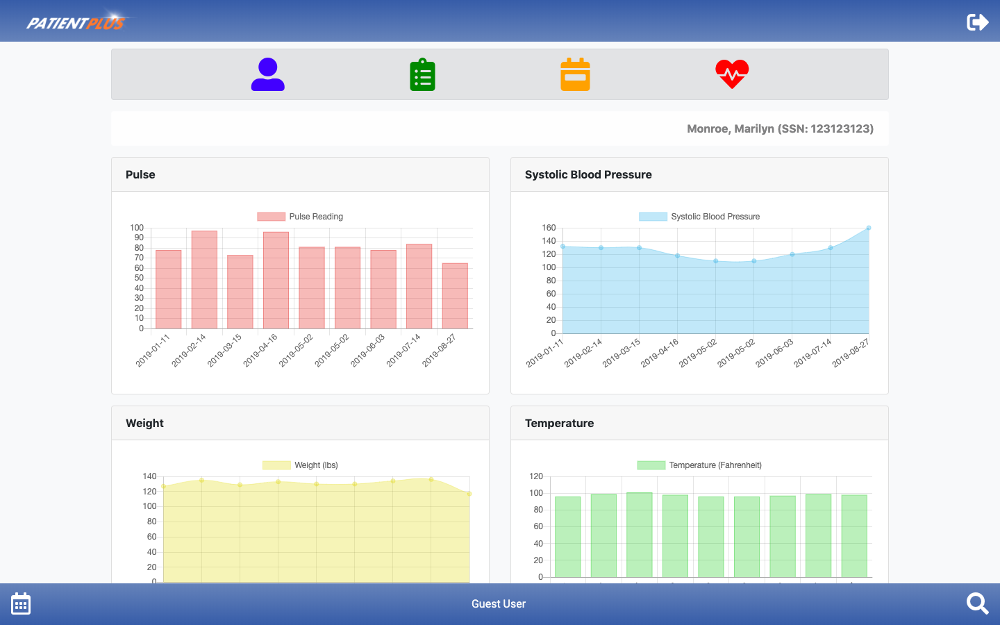
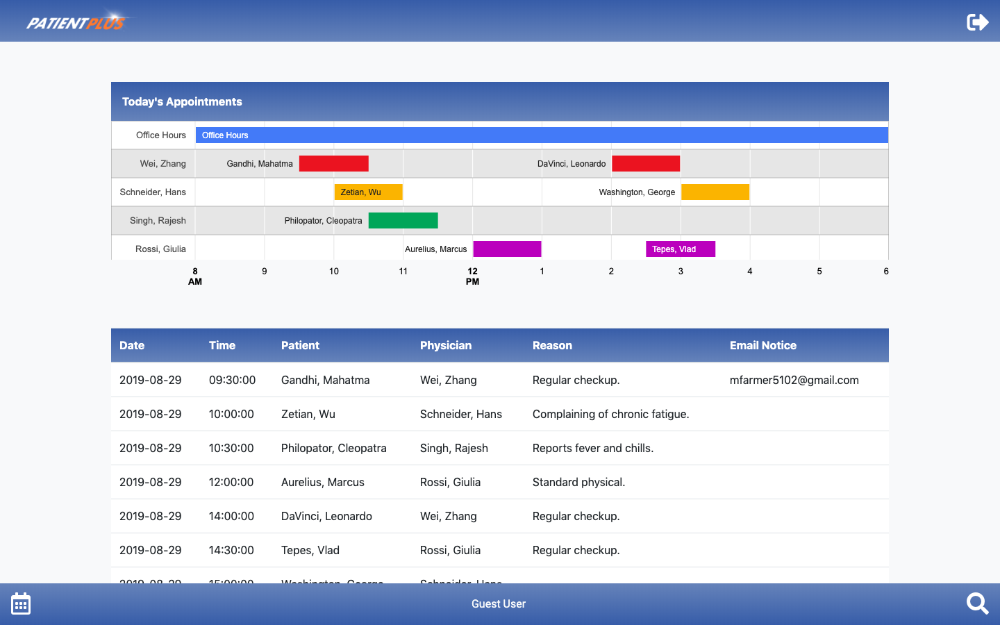

# **Career Coach**

## Credits

©2019 Matthew Farmer, Mark Bullard, Sarah Werner, and Zacharey Casey

## Application Link

http://patientplus.herokuapp.com/

## About

Patient Plus is an electronic patient management system designed to serve a doctor’s office, hospital, or other medical environment. It is designed to empower medical professionals to record and analyze data, make predictions from historical trends, schedule appointments, and reduce risk of mistaken patient identity.

## Walkthrough

### Login

Upon accessing the application, users are prompted for their login credentials. Users who do not wish to login or create an account my opt to proceed as a guest.

### Patient Search

After logging in, users may enter the SSN for a particular patient. If a valid SSN is entered for an existing patient, a patient card will be returned. If the patient does not yet exist in the system, users may click 'Add a New Patient' to add the patient to the database. Clicking on the patient card will direct the user to the patient's profile.

### Patient Information

### Print Wristband

### Patient Appointments

### Patient Vitals

### All Appointments

## Technologies Used

This application is built on NodeJS and hosted via Heroku. The following is a list of utilized technologies:

- Animate.css
- Bootstrap
- ChartsJS
- Express
- Firebase Authentication
- Google Charts API
- Handlebars
- Heroku
- jQuery
- Materialize
- Moment (package)
- MySQL (via JawsDB)
- NodeJS
- Nodemailer (package)
- Sequelize
- UUID (package)